<div align="center">

<picture>
  <source media="(prefers-color-scheme: dark)" srcset=".github/assets/grid-logo-dark.svg">
  
</picture>

### Build your company with a team of agents.

One self-hosted workspace for your people, your AI coding agents and your code. The board, the
threads, the files and the terminal, on the machine that holds the project, from any device.

**Beta** · Any AI provider · Runs on a laptop, a VPS or a Codespace ·
[MIT](LICENSE-MIT) or [Apache-2.0](LICENSE-Apache-2.0)

<a href="https://github.com/rabtx/grid/releases/tag/v0.2.0-beta">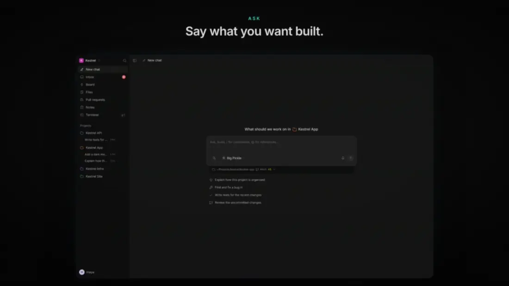</a>

[**Website**](https://grid.rabtx.dev) · [Watch the intro](https://github.com/rabtx/grid/releases/tag/v0.2.0-beta) · [Install](#install) · [What works today](#what-works-today) · [Docs](apps/docs/content/docs/index.mdx)

</div>

```bash
curl -fsSL https://grid.rabtx.dev/install.sh | bash
```

<sub>Linux or macOS, with git. Adds Grid on port 8080 and prints a link that creates your account.
To add another machine to a Grid you already run: <code>… | bash -s -- runner</code>. See
<a href="#install">Install</a>.</sub>

---

## Why Grid

A task, its code, the agent working on it and the terminal running it usually live in four
different places. Grid puts them around the **project folder**, so the context is already there:

1. **Plan.** Tasks live on the project's board, for people and agents alike.
2. **Ask.** Start a thread in the project and say what you want built.
3. **Watch it work.** The agent runs in the real folder. Every command, edit, diff and test
   streams into the thread, and it asks before doing anything you haven't allowed.
4. **Carry on anywhere.** Close the laptop and pick the thread up on your phone. The work kept
   going on the machine with the code.

Agents are workers in the project, not a chat box next to it. Grid is not tied to one AI provider,
one machine or one deployment platform: the execution machine is disposable, while projects,
threads and context persist.

## See it

<table>
  <tr>
    <td width="50%">
      <picture><source media="(prefers-color-scheme: dark)" srcset=".github/assets/thread-dark.webp">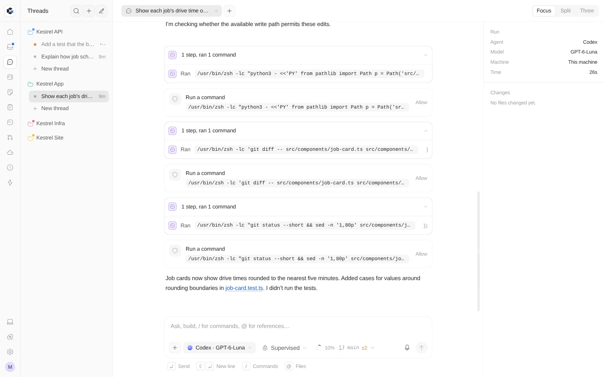</picture>
      <p align="center"><b>Threads</b><br><sub>Every command, edit and test the agent makes, as it happens.</sub></p>
    </td>
    <td width="50%">
      <picture><source media="(prefers-color-scheme: dark)" srcset=".github/assets/board-dark.webp">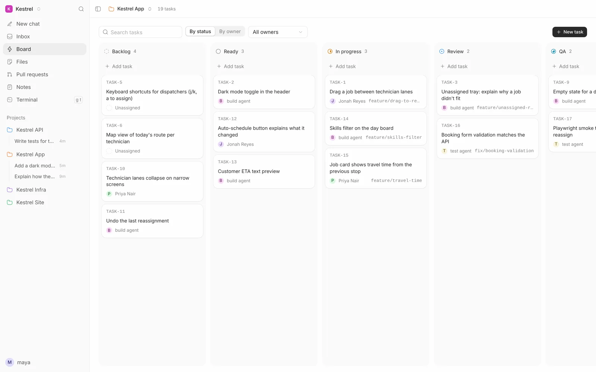</picture>
      <p align="center"><b>Board</b><br><sub>Plan the work and hand tasks to people or agents.</sub></p>
    </td>
  </tr>
  <tr>
    <td width="50%">
      <picture><source media="(prefers-color-scheme: dark)" srcset=".github/assets/files-edit-dark.webp">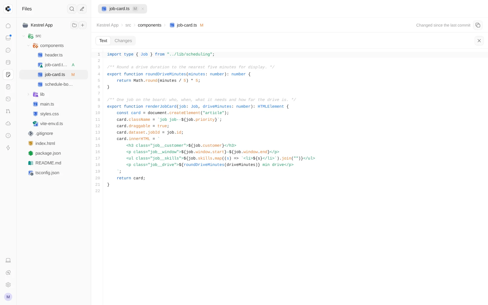</picture>
      <p align="center"><b>Files and editor</b><br><sub>Browse and edit the project's files in the browser.</sub></p>
    </td>
    <td width="50%">
      <picture><source media="(prefers-color-scheme: dark)" srcset=".github/assets/terminal-dark.webp">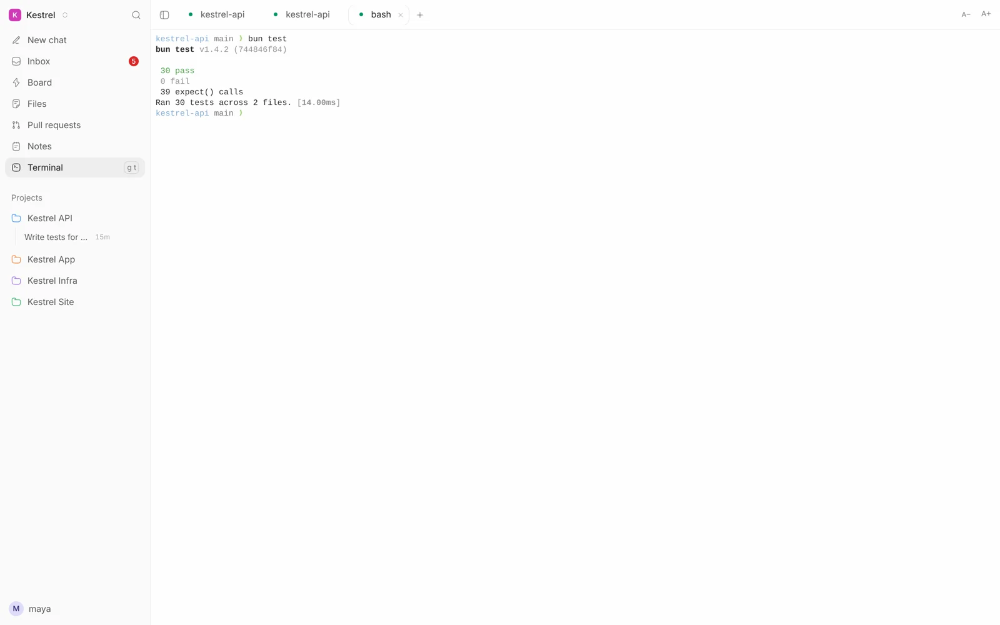</picture>
      <p align="center"><b>Terminal</b><br><sub>Persistent terminals on the machine with the code.</sub></p>
    </td>
  </tr>
  <tr>
    <td width="50%">
      <picture><source media="(prefers-color-scheme: dark)" srcset=".github/assets/model-picker-dark.webp">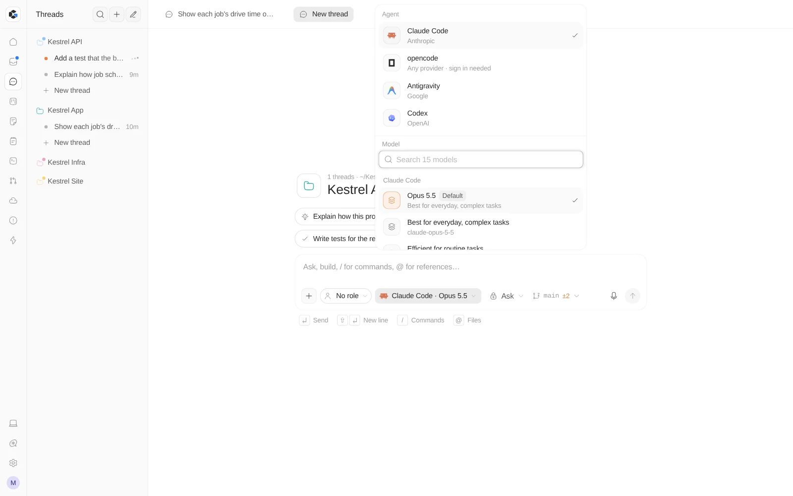</picture>
      <p align="center"><b>Any agent, any model</b><br><sub>Claude Code, Codex, opencode, Antigravity and any ACP agent.</sub></p>
    </td>
    <td width="50%">
      <picture><source media="(prefers-color-scheme: dark)" srcset=".github/assets/inbox-dark.webp">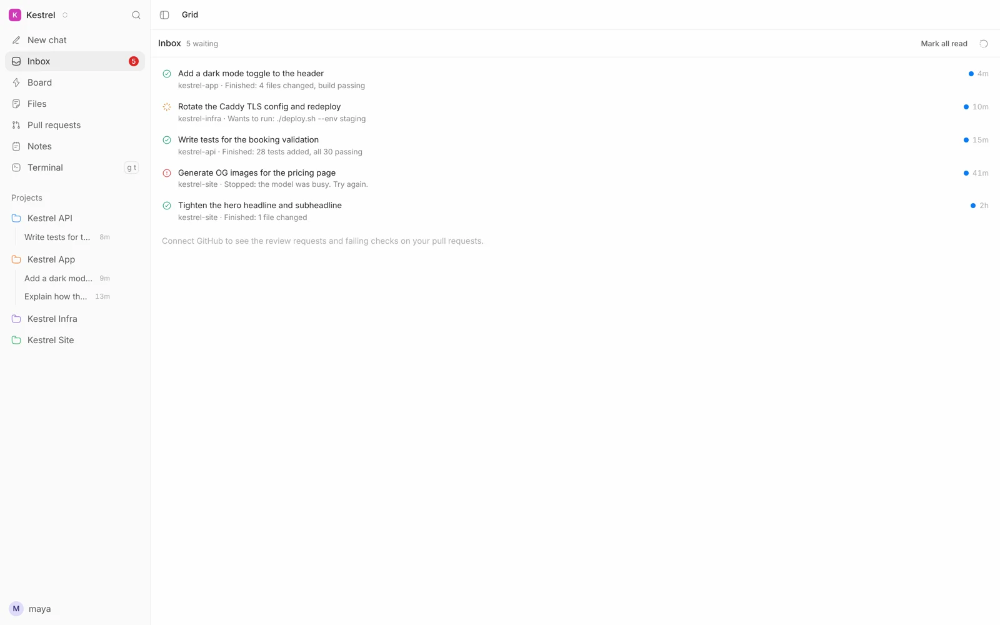</picture>
      <p align="center"><b>Inbox</b><br><sub>Everything waiting on you, across every project.</sub></p>
    </td>
  </tr>
</table>

<p align="center">
  <picture><source media="(prefers-color-scheme: dark)" srcset=".github/assets/m-home-dark.webp">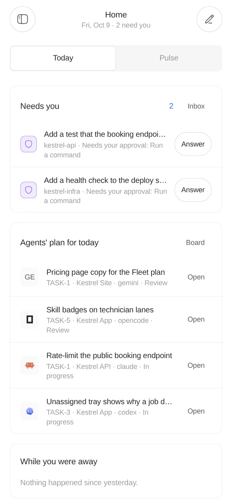</picture>
  &nbsp;
  <picture><source media="(prefers-color-scheme: dark)" srcset=".github/assets/m-thread-dark.webp">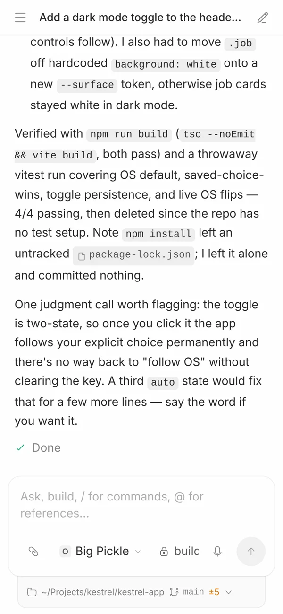</picture>
  &nbsp;
  <picture><source media="(prefers-color-scheme: dark)" srcset=".github/assets/m-board-dark.webp">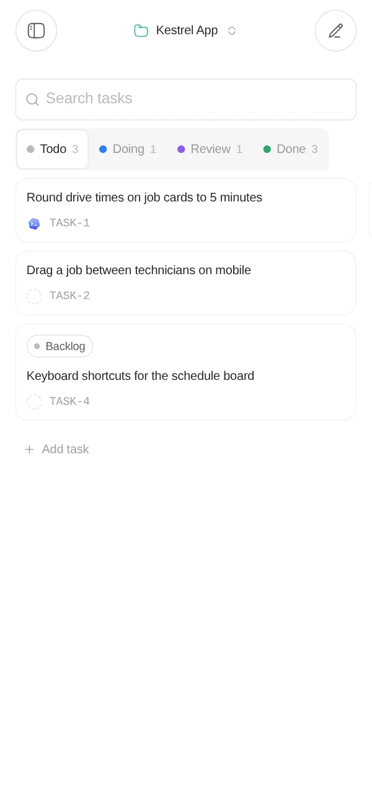</picture>
  &nbsp;
  <picture><source media="(prefers-color-scheme: dark)" srcset=".github/assets/m-inbox-dark.webp">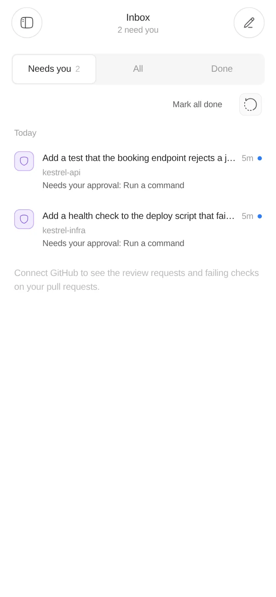</picture>
  <br><sub><b>Built for phones too.</b> An installable app that opens instantly, with touch-first controls.</sub>
</p>

<sub>Screens from an example workspace, "Kestrel", a fictional field-service startup. The agent
threads shown are real runs.</sub>

## What works today

| Area | What you can do |
| --- | --- |
| **Workspaces** | A workspace is the company: it owns projects and environments, and people join by invite. Self-hosted setup starts from a one-time link. |
| **Projects and board** | Link project folders, then plan tasks from backlog to done, owned by people or agents, with notes per project. |
| **Agent threads** | Talk to Claude Code, Codex, opencode and Antigravity, or any agent that speaks ACP. Replies, tool calls, diffs and approvals stream live, and threads resume after a restart. Pick the model, effort and mode per thread. |
| **Composer** | `@` to mention files, `/` for commands, attach images and files, dictate by voice, and choose the branch or a fresh worktree from the git control under the box. |
| **Files and terminals** | Browse the project, edit files in the browser with conflict-safe saves, and use persistent terminals on the project's machine. |
| **Git and pull requests** | Worktrees per thread when you want them; a project's pull requests with checks and reviews, and "fix with an agent" to hand a failing PR to an agent on its own branch. |
| **Inbox and notifications** | One inbox for approvals, finished and failed runs, review requests and failing checks, with push notifications to your devices. |
| **Environments** | Run projects on this machine, on a paired Grid instance, or in a GitHub Codespace managed from Grid. |
| **Phone and offline** | The console installs as an app; recent screens open instantly and the shell reopens offline. Live agent and terminal work needs the runner. |

Grid is a working development workspace today, not yet the full startup operating system in its
mission: deployment, operations and business management are later product areas. The
[project reference](PROJECT.md) explains the architecture and where data lives.

## Install

On Linux or macOS, with git:

```bash
curl -fsSL https://grid.rabtx.dev/install.sh | bash
```

It installs Bun if it is missing, puts Grid in `~/.grid`, starts it on port 8080 as a user service
(systemd or launchd) and prints a one-time link that creates your account and workspace; after
that, people join by invite. A `grid` command manages it: `grid status`, `grid logs`,
`grid update`, `grid uninstall`.

Grid keeps its data in an embedded database by default. To keep it beyond this machine, threads
included, point it at a hosted Postgres and use `grid restore` on the next machine:

```bash
curl -fsSL https://grid.rabtx.dev/install.sh | GRID_DATABASE_URL='postgres://…' bash
```

To add another machine (a VPS, a Codespace, a second laptop) to a Grid you already run, install
only the runner there. It listens on your [Tailscale](https://tailscale.com) network and prints an
address and a pairing code to add in **Settings → Environments**:

```bash
curl -fsSL https://grid.rabtx.dev/install.sh | bash -s -- runner
```

The script is [scripts/bash/install.sh](scripts/bash/install.sh).

### From a checkout

You need [Bun](https://bun.sh) **1.4.2**.

```bash
git clone https://github.com/rabtx/grid.git
cd grid
bun install
bun run grid
```

The launcher prints the same one-time setup link (also saved in `.grid/setup-link.txt`).
`bun run grid` uses an embedded database under `.grid/` when `DATABASE_URL` is unset, applies
migrations, builds the console, and runs the API and runner behind one port.

Install at least one agent CLI on the machine (Grid can help from **Settings → Agents**). For a
Codespace or VPS, environment variables, pairing and deployment, read the
[portable Grid guide](apps/docs/content/docs/portable.mdx). To work on individual services, see
[development commands](PROJECT.md#development-commands).

## How it works

```
 browser / phone ──▶ console (Solid 2 PWA)
                          │
                ┌─────────┴──────────┐
                ▼                    ▼
        API (Hono on Bun)     runner (Bun) ── agent CLIs · terminals · files · git
        people, projects,          │
        tasks, notes               └──▶ paired Grid environments and Codespaces
        (PostgreSQL)
```

- **Console:** the product interface, a Vite + Solid 2 app that installs as a PWA.
- **API:** identity, workspaces, projects, tasks and notes, on Hono with PostgreSQL.
- **Runner:** lives on the machine with the code. It drives agent CLIs, keeps threads in SQLite,
  and serves terminals, files and git to the console. Other machines join as paired environments.

One `bun run grid` runs all three behind a single port, so a whole Grid is one disposable bundle.

## What's next

- **Automations:** agent jobs that run on a schedule or when a pull request opens or a check fails.
- **Agent commands:** each agent's own slash commands in the composer's `/` menu.
- **A cleaner composer:** one `+` for files, photos, project files, mentions and commands, with
  upload progress and previews.

The [open board](.agents/board/open/) tracks what's being built; the
[plans](.agents/plans/) describe broader directions. These are directions, not release dates.

## Repository map

| Path | Role |
| --- | --- |
| `apps/console` | Solid 2 product interface and installable PWA |
| `apps/runner` | Bun service for agents, chat sessions, terminals, project files, and environments |
| `apps/launcher` | `bun run grid`: setup and one-port gateway |
| `apps/api` | The Grid API (Hono on Bun) for identity, projects, tasks, notes, and billing |
| `apps/web` | Next.js landing page; the Solid console is the product |
| `apps/docs` | Setup, API, architecture, and deployment guides |
| `packages/` | Shared tokens, UI, logging, and TypeScript configuration |
| `.agents/` | Project board, plans, ownership, and agent work rules |

Grid uses Bun workspaces. See [PROJECT.md](PROJECT.md) for development commands and technical
boundaries, [DESIGN.md](DESIGN.md) for the interface language, and [AGENTS.md](AGENTS.md) before
contributing code. Documentation source lives in `apps/docs/content/docs/`.

## License

Choose either [MIT](LICENSE-MIT) or [Apache-2.0](LICENSE-Apache-2.0).

The file icons in `apps/console/public/file-icons/` are the paid
[Flow Icons](https://flow-icons.pages.dev) pack by thang-nm, used with the author's permission. They
are not covered by either license; see that folder's [README](apps/console/public/file-icons/README.md).
